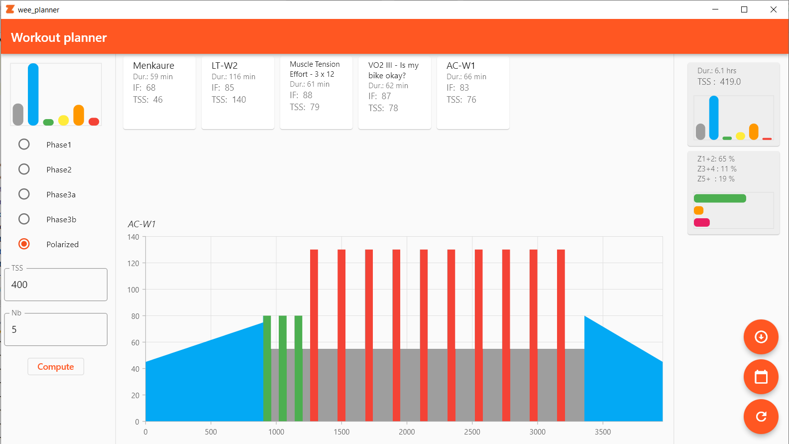

# wee_planner

Workout TSS planner uses a private workout library to schedule workouts based on a target weekly TSS and power zones.

The software can push workouts for a given week to www.intervals.icu for easy management.



## Getting Started

WeePlanner is a flutter app, you will need an up-to-date flutter installation.  

Create your own keys.dart file containing your login information:

```dart

const String athleteID = 'i12345';

const String auth_key = 'xxxxxxxxxxxxxxxxxxxxxxxxxxxxxxxxxxxxxxxxxxxxxx';

```

Compile and run !
